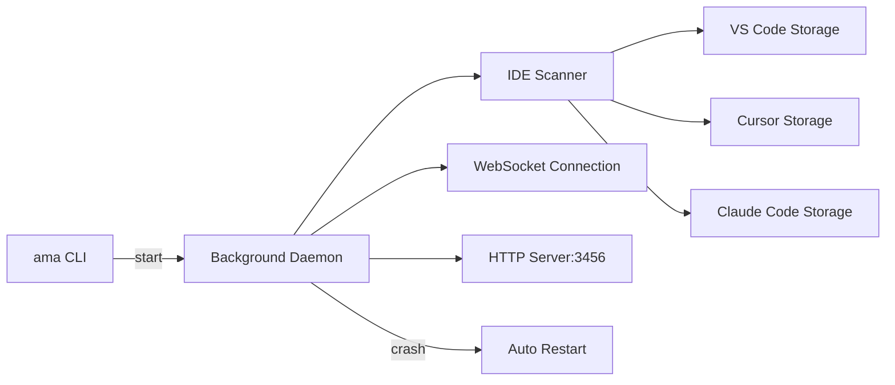

# Background Daemon Mode with IDE Project Detection

## Architecture Overview




## Key Changes

### 1. Daemon Manager (`packages/ama-agent/src/lib/daemon.ts`)

Create a new daemon module that handles:

- Background process spawning using `child_process.fork()` with `detached: true`
- PID file management at `~/.ama/daemon.pid`
- Trace ID generation (random hex string)
- Auto-restart logic with configurable max retries
- Graceful shutdown handling

### 2. IDE Storage Scanner (`packages/ama-agent/src/lib/ide-scanner.ts`)

Scan IDE storage files to detect open projects:

- **VS Code**: `~/Library/Application Support/Code/User/globalStorage/storage.json`
- **Cursor**: `~/Library/Application Support/Cursor/User/globalStorage/storage.json`  
- **Claude Code**: `~/Library/Application Support/Claude/User/globalStorage/storage.json` (or similar path)

The scanner will extract recently opened workspaces and expose them via the HTTP server.

### 3. Updated CLI Commands ([`packages/ama-agent/src/cli.ts`](packages/ama-agent/src/cli.ts))

```javascript
ama                  Start daemon in background (default)
ama start            Same as above
ama stop             Stop the running daemon
ama status           Show daemon status and tracked projects
ama restart          Restart the daemon
ama foreground       Run in foreground (current behavior)
ama login/logout     Auth commands (unchanged)
```


### 4. Startup Output Format

```javascript
operation: starting background mode, trace ID: 58bb2e619f8cbc2a66a4fdfe194bab23, version: a0b5c28
detected projects:
    - /Users/you/Projects/ama (Cursor)
    - /Users/you/Projects/other-project (VS Code)
daemon started successfully (PID: 12345)
```


### 5. Updated HTTP Endpoints ([`packages/ama-agent/src/http.ts`](packages/ama-agent/src/http.ts))

Add new endpoints:

- `GET /projects` - List all detected IDE projects
- `GET /daemon/info` - Return trace ID, version, uptime, PID

## Files to Create/Modify