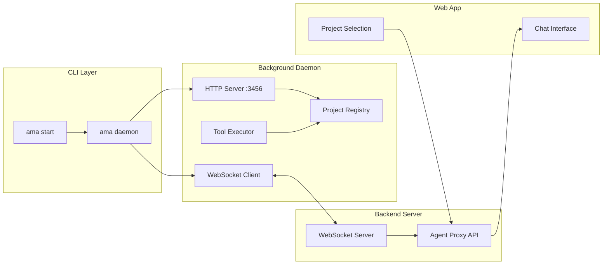
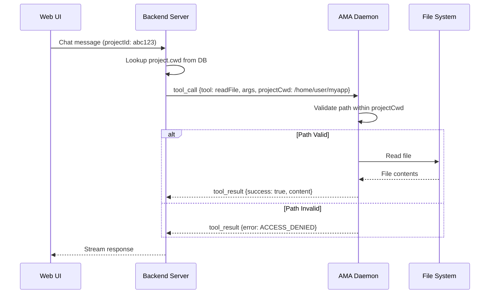

# Background Daemon with Directory-Scoped Agent

## Architecture Overview




## Key Changes

### 1. Enhanced Daemon Process ([`packages/ama-agent/src/lib/daemon.ts`](packages/ama-agent/src/lib/daemon.ts))

Transform into a proper background daemon using `node:child_process` with `detached: true`. The daemon will:

- Persist after terminal closes
- Write PID to `~/.ama/daemon.pid`
- Maintain a single WebSocket connection to the server
- Handle multiple project contexts
```typescript
// Key daemon lifecycle
export function startDaemon() {
    const daemon = spawn(process.execPath, [daemonScript], {
        detached: true,
        stdio: ['ignore', logFd, logFd],
        env: { ...process.env, AMA_DAEMON: '1' }
    });
    daemon.unref();
    fs.writeFileSync(DAEMON_PID_FILE, String(daemon.pid));
}
```


### 2. Project Registry ([`packages/ama-agent/src/lib/project-registry.ts`](packages/ama-agent/src/lib/project-registry.ts) - NEW)

Maintain registered projects with their `cwd` paths:

```typescript
interface RegisteredProject {
    id: string;
    cwd: string;
    name: string;
    active: boolean;
}

class ProjectRegistry {
    private projects = new Map<string, RegisteredProject>();
    
    register(projectId: string, cwd: string): void;
    getProjectCwd(projectId: string): string | null;
    isPathAllowed(projectId: string, targetPath: string): boolean;
}
```


### 3. Directory Sandboxing in Tools

Each tool will receive `projectCwd` and validate all file paths. Example for [`packages/ama-agent/src/tools/read-file.ts`](packages/ama-agent/src/tools/read-file.ts):

```typescript
function isPathWithinProject(filePath: string, projectCwd: string): boolean {
    const resolved = path.resolve(projectCwd, filePath);
    const normalized = path.normalize(resolved);
    return normalized.startsWith(path.normalize(projectCwd));
}

export const read_file = async function(input: ReadFileInput, projectCwd: string) {
    if (!isPathWithinProject(input.relative_file_path, projectCwd)) {
        return { success: false, error: 'ACCESS_DENIED', message: 'Path outside project directory' };
    }
    // ... existing logic with projectCwd as base
}
```


### 4. Updated Server Protocol ([`packages/ama-agent/src/server.ts`](packages/ama-agent/src/server.ts))

Tool calls now include `projectId` and `projectCwd`:

```typescript
interface ToolCall {
    type: 'tool_call';
    id: string;
    tool: string;
    args: Record<string, any>;
    projectId: string;    // NEW
    projectCwd: string;   // NEW
}

// Execute with scoped context
const result = await executor(message.args, message.projectCwd);
```


### 5. CLI Commands ([`packages/ama-agent/src/cli.ts`](packages/ama-agent/src/cli.ts))

Add new commands:| Command | Description ||---------|-------------|| `ama daemon start` | Start background daemon || `ama daemon stop` | Stop background daemon || `ama daemon status` | Check daemon status || `ama project add <path>` | Register a project directory || `ama project list` | List registered projects |

### 6. HTTP API Updates ([`packages/ama-agent/src/http.ts`](packages/ama-agent/src/http.ts))

New endpoints for project management:

```typescript
app.post("/projects/register", async (c) => {
    const { projectId, cwd, name } = await c.req.json();
    projectRegistry.register(projectId, cwd, name);
    return c.json({ success: true });
});

app.get("/projects", (c) => {
    return c.json({ projects: projectRegistry.list() });
});
```


### 7. Backend Server Updates ([`apps/server/src/lib/executeTool.ts`](apps/server/src/lib/executeTool.ts))

Include project context when dispatching tool calls:

```typescript
export const executeTool = async (toolName: string, args: Object, projectId: string, projectCwd: string) => {
    wsConnection.send(JSON.stringify({
        type: "tool_call",
        id: callId,
        tool: toolName,
        args,
        projectId,
        projectCwd,  // Agent uses this to sandbox operations
    }));
}
```


## Data Flow for Tool Execution

